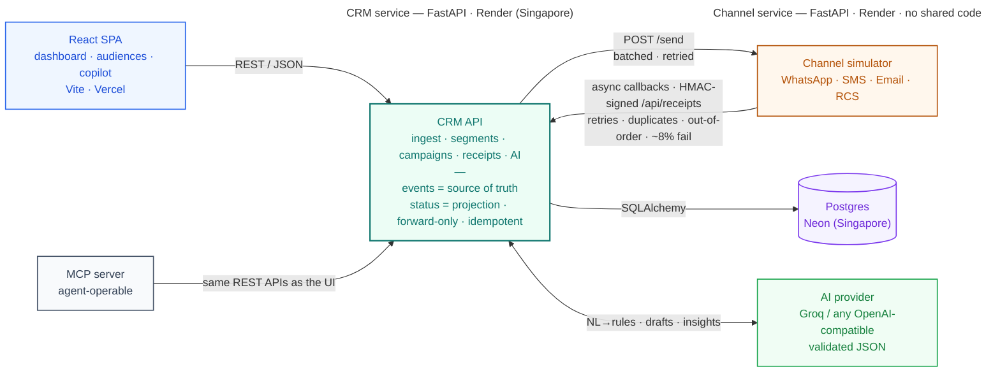

# Iris — AI-native shopper engagement

A take on the Xeno assignment: an AI-native mini CRM for a D2C brand, built
around one product point of view — **you describe the campaign, the AI builds
it, you approve it.** The marketer expresses intent in natural language; the
AI answers with *structured, editable artifacts* (segment rules with a live
audience preview, message variants, channel suggestion). Nothing sends
without explicit human approval.

## Live demo

| | |
|---|---|
| **App** | https://xeno-mini-crm-one-ruddy.vercel.app |
| **Login** | `admin@iris.shop` · `iris123` |
| **CRM API** | https://iris-crm.onrender.com ([`/docs`](https://iris-crm.onrender.com/docs)) |
| **Channel** | https://iris-channel.onrender.com |

Frontend on Vercel, both services on Render (Singapore region), Postgres on
Neon, AI via Groq. The services run on free tiers — a [keep-alive
workflow](.github/workflows/keepalive.yml) pings them every 10 minutes, but the
very first request after a long idle can still take ~50s to wake.

> **Viewing the demo:** best in **Chrome**. On **Brave**, the privacy Shields can
> block the cross-origin API call (UI on `vercel.app`, API on `onrender.com`) and
> leave the app on its loading screen — click the **🦁 lion icon → Shields down
> for this site**, then reload.

## Architecture



Two genuinely separate services with no shared code — they speak only HTTP,
like a real CRM and a real channel provider would.

### The delivery loop (the part that matters)

1. **Dispatch** — launching a campaign materialises the audience from the
   segment's rule snapshot, writes one `messages` row per recipient
   (`queued`) *before any network call*, then POSTs to the channel in
   batches of 100 with bounded exponential-backoff retries. The channel ACKs
   202; nothing about outcomes is known yet.
2. **Simulation** — the channel asynchronously decides each message's fate
   (per-channel engagement profiles, ~8% hard failures) and calls back into
   `POST /api/receipts`. It deliberately misbehaves like real providers:
   random delays, ~15% of lifecycles delivered out of order, ~10% duplicate
   callbacks, retries with backoff when the CRM errors, and every callback
   HMAC-signed.
3. **Ingestion** — the CRM verifies the signature against raw bytes, then
   applies each event through a small state machine:
   * `message_events.event_id` is UNIQUE → **duplicates are idempotent no-ops**
   * statuses have a monotonic rank and only move forward → **out-of-order
     arrivals never regress state** (a late `delivered` after `clicked` is
     recorded in the ledger but doesn't change the projection)
   * `failed`/`converted` are terminal; `converted` creates an **attributed
     order**, closing the loop from message → revenue.

Events are the source of truth (append-only ledger); `messages.status` is a
read-model projection. Funnel stats read straight off `status_rank`, so the
insights page needs no event-table scans.

## AI integration (four touchpoints, one pattern)

| Where | What |
|---|---|
| `POST /api/ai/chat` | **The copilot** — a conversation that ends in a complete, editable campaign plan: audience rules + live count, channel + reasoning, message variants. Approving it creates a *draft* campaign; launch still goes through the human-approval modal |
| `POST /api/ai/segment` | Natural language → segment rule DSL → live audience count + sample, in one round trip |
| `POST /api/ai/draft` | Objective → 2–3 message variants with channel-specific constraints and personalisation tokens |
| `GET /api/ai/campaigns/{id}/summary` | Campaign stats → 2–3 sentence analyst-style narrative |

The pattern everywhere: the model must return JSON matching our Pydantic
schemas (Anthropic: forced tool call; OpenAI-compatible: JSON mode), and the
output is **validated before anything trusts it**. The AI never writes SQL —
it writes a small whitelisted rule DSL (`app/schemas.py`) that a
deterministic compiler (`app/services/segment_engine.py`) turns into a
query. AI proposes; code disposes.

**Provider-agnostic, free to run**: works with Anthropic *or* any
OpenAI-compatible endpoint — free tiers of Groq, Google Gemini, and
OpenRouter, or a local Ollama. `backend/.env.example` has copy-paste
configs; the UI degrades gracefully with no key at all.

## Repository layout

```
backend/
  app/
    main.py                 FastAPI app, CORS, dashboard
    config.py               env-driven settings
    models.py               6 tables; events ledger + status projection
    schemas.py              Pydantic schemas incl. the segment rule DSL
    routers/                ingest · segments · campaigns · receipts · ai
    services/
      segment_engine.py     DSL → SQLAlchemy compiler (NULL-safe recency logic)
      dispatcher.py         audience → messages → batched channel sends
      receipt_processor.py  idempotent, out-of-order-safe state machine
      ai_service.py         Anthropic calls, tool-forced JSON, validated
    seed.py                 1,200 customers / ~5k orders, shaped RFM profiles
  tests/                    12 tests: state machine + DSL semantics
channel-service/
  app/main.py               the simulator (no shared code with the CRM)
mcp-server/
  server.py                 MCP tools wrapping the CRM (agent-operable)
frontend/
  src/
    pages/                  dashboard · customers · audiences · campaigns · copilot
    components/RuleEditor   recursive editor for the segment rule DSL
```

## Agent-operable (MCP)

`mcp-server/` exposes the campaign loop as [Model Context Protocol](https://modelcontextprotocol.io)
tools, so Claude Desktop (or any MCP client) can run marketing end to end by
conversation — build an audience, draft copy, launch, read the funnel. It
speaks only HTTP to the CRM (no shared code, like the channel service), and a
campaign launched by an agent goes through the same send → receipt → stats
loop. See [mcp-server/README.md](mcp-server/README.md).

## Running locally

```bash
# Terminal 1 — channel simulator
cd channel-service
pip install -r requirements.txt
uvicorn app.main:app --port 8001

# Terminal 2 — CRM
cd backend
pip install -r requirements.txt
cp .env.example .env            # add ANTHROPIC_API_KEY for AI features
python -m app.seed
uvicorn app.main:app --port 8000

# Terminal 3 — frontend (Vite + React, http://localhost:5173)
cd frontend
npm install
npm run dev                     # VITE_API_URL defaults to http://localhost:8000
```

API docs at http://localhost:8000/docs. Tests: `cd backend && pytest`.
`./e2e_test.sh` (repo root) runs the whole loop unattended and prints the
resulting funnel.

## Deployment

A [render.yaml](render.yaml) blueprint deploys both services in one click:

1. **Neon** — create a free Postgres DB, copy the connection string.
2. **Render** — *New → Blueprint*, point at this repo. Fill in on `iris-crm`:
   `DATABASE_URL` (Neon),
   `CHANNEL_SERVICE_URL` = `https://iris-channel.onrender.com`,
   `CRM_PUBLIC_URL` = `https://iris-crm.onrender.com` (the channel calls back
   here), and AI — either `ANTHROPIC_API_KEY`, or the free trio
   `AI_API_KEY` + `AI_BASE_URL` + `AI_MODEL` (e.g. Groq:
   `https://api.groq.com/openai/v1`, `llama-3.3-70b-versatile`).
   `WEBHOOK_SECRET` is auto-generated and shared via an env group; the CRM
   seeds itself on first boot.
3. **Vercel** — import the repo, set *Root Directory* to `frontend/`, add
   env var `VITE_API_URL` = the `iris-crm` URL. `frontend/vercel.json` already
   handles SPA rewrites. The Data sources page, API snippets and MCP config
   all read this URL, so they show the live host automatically.

The MCP server points at the live CRM by setting `CRM_BASE_URL` in
`claude_desktop_config.json` — no code change needed.

Architecture decisions and their trade-offs are documented in
[DECISIONS.md](DECISIONS.md).

## Scale assumptions & conscious trade-offs

| Did here | Would do at scale | Why fine for this scope |
|---|---|---|
| FastAPI `BackgroundTasks` for dispatch | Queue (SQS/Kafka) + worker pool; survives restarts, horizontally scalable | Single process, thousands not millions of sends. The `queued`-row-first design migrates without schema changes. |
| Synchronous receipt processing | Webhook → queue → consumers; partition by `message_id` | Idempotency + forward-only ranks already give the same correctness guarantees |
| `create_all` on boot | Alembic migrations | One schema, four days |
| Status counts computed per request | Incremental counters / materialised rollups | Indexed `(campaign_id, status)` is plenty at this volume |
| Single AI model, no caching | Prompt caching, cheaper model for drafts | Cost is negligible at demo volume |

## What I'd build next

Segment editing UI for AI-generated rules (the API already treats rules as
data, so this is pure frontend), scheduled/recurring campaigns, A/B sending
of message variants (the draft endpoint already returns multiple), and
control-group holdouts for honest attribution.
